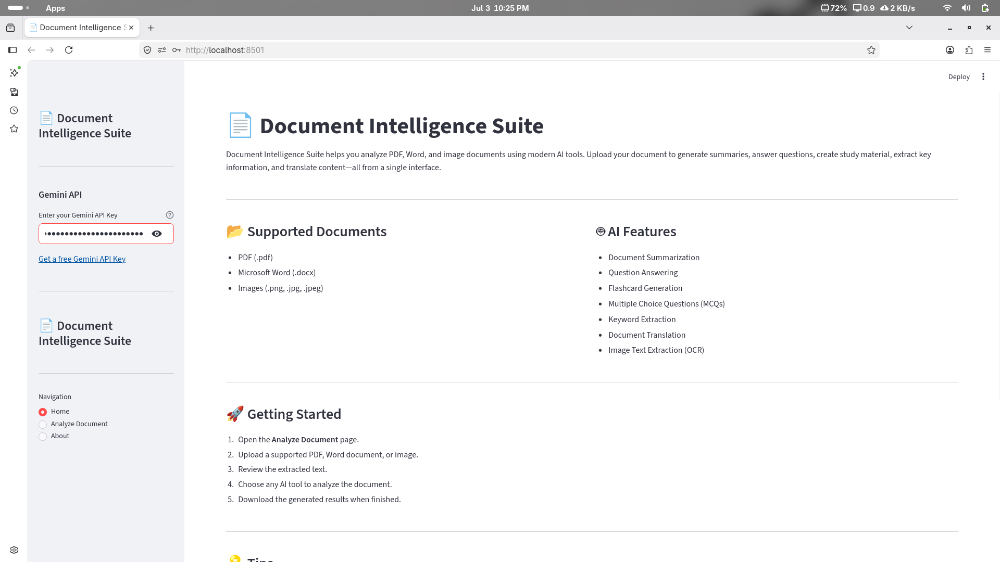
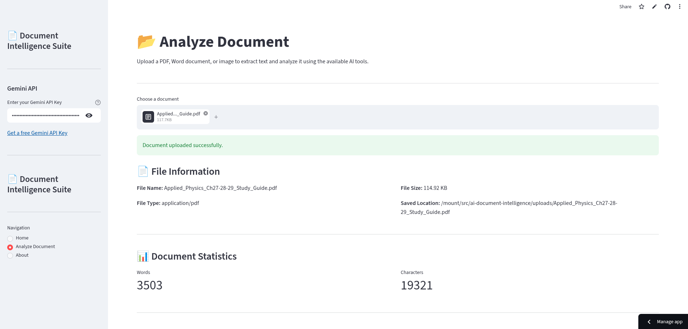
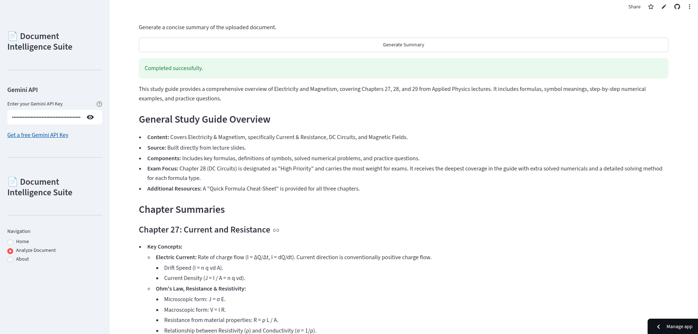
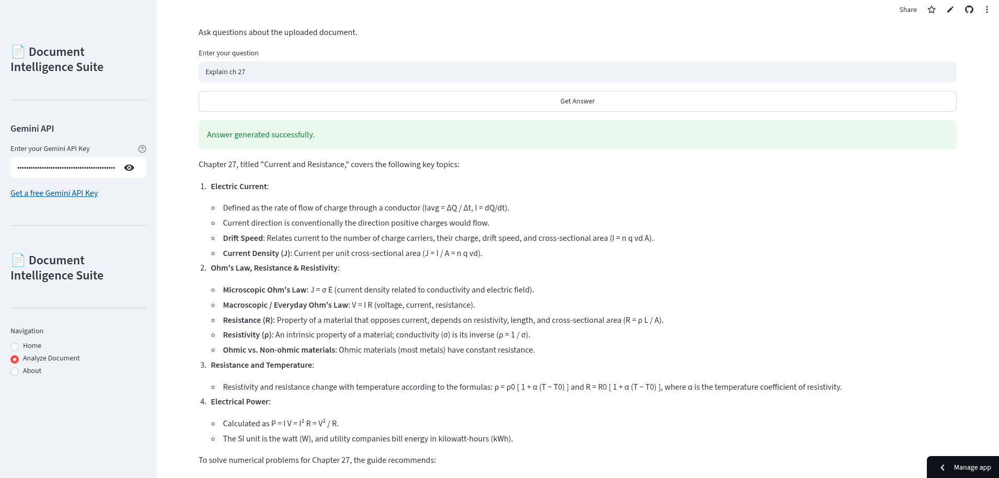
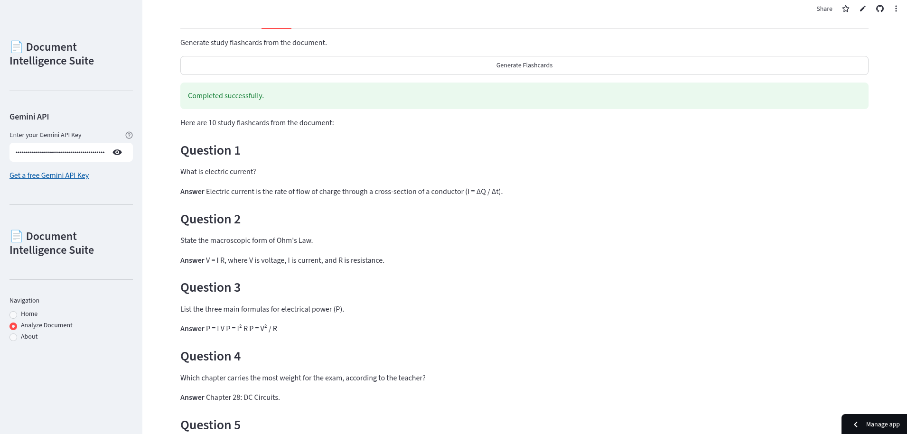
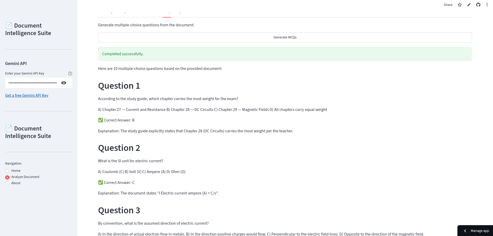
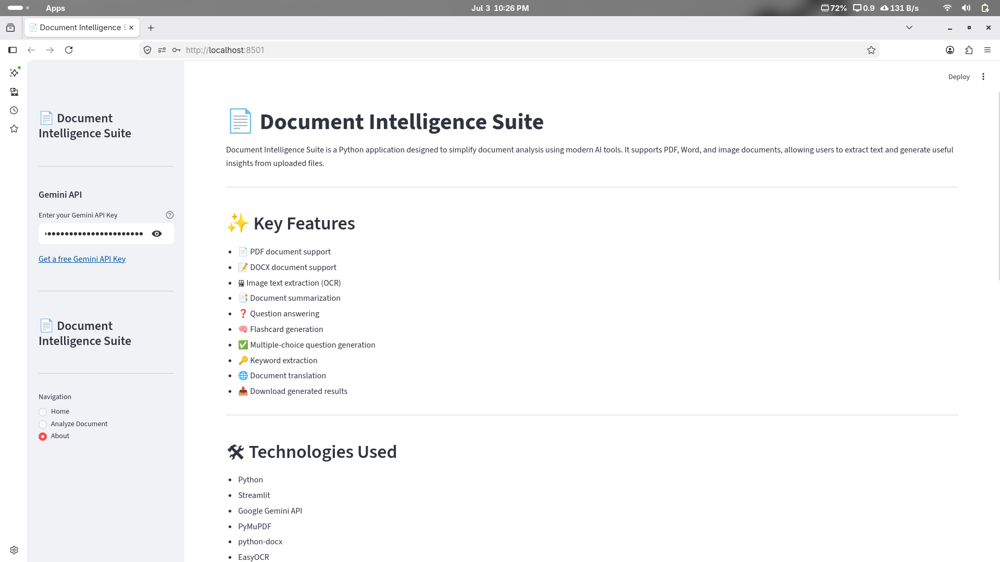

# 📄 AI Document Intelligence Suite

> An AI-powered document analysis platform built with **Python**, **Streamlit**, and **Google Gemini AI** that enables users to analyze PDFs, Word documents, and images through intelligent summarization, question answering, OCR, translation, flashcards, and more.

---

## 🌐 Live Demo

🔗 **Streamlit App:**  
https://ai-document-intelligence-fsomujrral6fehfzc7uehp.streamlit.app/

---

## ✨ Features

### 📂 Document Support
- 📄 PDF Documents (.pdf)
- 📝 Microsoft Word (.docx)
- 🖼 Images (.png, .jpg, .jpeg)

### 🤖 AI-Powered Analysis
- 📑 Intelligent Document Summarization
- ❓ Ask Questions About the Document
- 🧠 Generate Study Flashcards
- ✅ Generate Multiple Choice Questions (MCQs)
- 🔑 Extract Important Keywords
- 🌍 Translate Documents into Multiple Languages

### 📊 Additional Features
- 📋 Automatic Text Extraction
- 📈 Document Statistics
- 💾 Download AI-generated Results
- 🔐 Secure User-Provided Gemini API Key
- 🎨 Clean & Responsive Streamlit Interface

---

# 🚀 Technologies Used

| Category | Technologies |
|----------|--------------|
| Programming Language | Python |
| Frontend | Streamlit |
| AI Model | Google Gemini 2.5 Flash |
| OCR | EasyOCR |
| PDF Processing | PyMuPDF |
| Word Processing | python-docx |
| Image Processing | Pillow |
| Environment Variables | python-dotenv |

---

# 📁 Project Structure

```text
AI-Document-Intelligence/
│
├── app.py
├── requirements.txt
├── README.md
│
├── services/
│   ├── summarizer.py
│   ├── qa.py
│   ├── flashcards.py
│   ├── mcq.py
│   ├── keywords.py
│   ├── translator.py
│   ├── gemini_client.py
│   └── ocr_service.py
│
├── utils/
│   ├── file_handler.py
│   ├── pdf_loader.py
│   ├── docx_loader.py
│   ├── ocr.py
│   └── ui_helpers.py
│
├── views/
│   ├── home.py
│   ├── analyze.py
│   └── about.py
│
└── uploads/
```

---

# ⚙️ Installation

## 1️⃣ Clone the Repository

```bash
git clone https://github.com/riazaslam029/AI-Document-Intelligence.git
```

---

## 2️⃣ Navigate to the Project

```bash
cd AI-Document-Intelligence
```

---

## 3️⃣ Create a Virtual Environment

```bash
python -m venv venv
```

### Activate Environment

**Windows**

```bash
venv\Scripts\activate
```

**Linux / macOS**

```bash
source venv/bin/activate
```

---

## 4️⃣ Install Dependencies

```bash
pip install -r requirements.txt
```

---

## 5️⃣ Run the Application

```bash
streamlit run app.py
```

The application will open in your default browser.

---

# 🔑 Gemini API Key

This project **does not store or expose any API keys**.

Simply obtain your free Gemini API key from:

https://aistudio.google.com/app/apikey

Then paste your key into the application's sidebar when prompted.

---

# 📖 How to Use

1. Launch the application.
2. Enter your Gemini API key.
3. Upload a PDF, Word document, or image.
4. View the extracted text.
5. Select any AI-powered feature:
   - Summary
   - Question Answering
   - Flashcards
   - MCQs
   - Keywords
   - Translation
6. Download the generated output.

# 📸 Screenshots

## 🏠 Home Page



---

## 📄 Analyze Document



---

## 📄 AI Summary



---

## ❓ Question Answering



---

## 🧠 Flashcards



---

## ✅ MCQ Generation



---

## ℹ️ About Page




# 🎯 Use Cases

- 📚 Students preparing for exams
- 👨‍🏫 Teachers creating study material
- 👨‍💼 Researchers analyzing reports
- 📑 Professionals reviewing documents
- 🌍 Users translating documents quickly

---

# 🚀 Future Improvements

- 💬 Chat with Documents
- 🧠 Retrieval-Augmented Generation (RAG)
- 📄 Export Results as PDF
- 📝 Export Results as DOCX
- 🌐 Support More Languages
- 📂 Additional File Formats
- 📊 AI Insights Dashboard
- 🔍 Semantic Search

---

# 👨‍💻 Developer

## Riaz Aslam

**Software Engineering Student**

### GitHub

https://github.com/riazaslam029

### LinkedIn

https://www.linkedin.com/in/riaz-aslam-0bb69b310/

---

# ⭐ Support

If you found this project useful, please consider giving it a ⭐ on GitHub.

Your support helps improve the project and motivates future development.

---

# 📜 License

This project is licensed under the **MIT License**.
